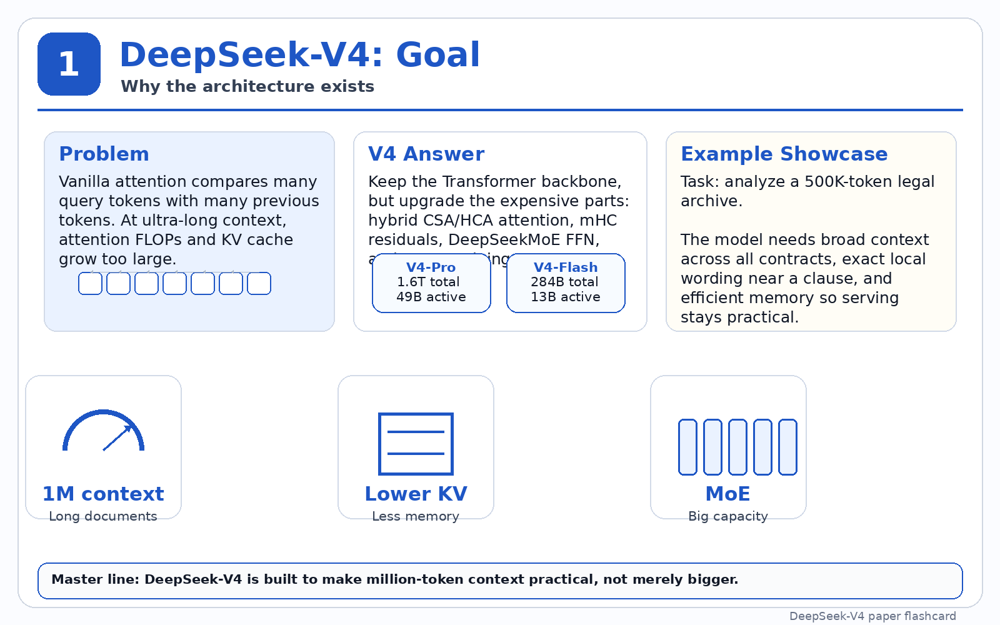

# deepseek-v4-architecture-visualizer

Interactive visual walkthrough of the DeepSeek-V4 architecture.

This repository contains a notebook demonstrating key design elements such as:
- mHC residuals
- CSA/HCA attention mechanisms
- Mixture-of-Experts (MoE) routing
- KV cache management
- million-token context handling

## Contents
- `deepseek_v4_paper_aligned_real_example.ipynb` — notebook with architecture visualization and examples.
- `images/` — folder containing DeepSeek-V4 flashcard visuals.

## Images
The repository includes a set of flashcard images that illustrate DeepSeek-V4 concepts:
- `images/deepseek_v4_flashcard_01.png`
- `images/deepseek_v4_flashcard_02.png`
- `images/deepseek_v4_flashcard_03.png`
- `images/deepseek_v4_flashcard_04.png`
- `images/deepseek_v4_flashcard_05.png`
- `images/deepseek_v4_flashcard_06.png`
- `images/deepseek_v4_flashcard_07.png`
- `images/deepseek_v4_flashcard_08.png`

Example image:

## Usage
1. Open the notebook in Jupyter or VS Code.
2. Run the cells to explore the architecture and visualization.

## Purpose
This project is intended as a lightweight, interactive reference for understanding DeepSeek-V4 architecture components and their interactions.
